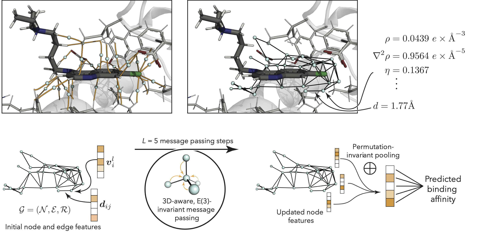

# bcpaff - Exploring protein-ligand binding affinity prediction with electron density-based geometric deep learning

Details are described in our [paper] (TODO: add link). Please cite if you use this work.



To setup the conda environment, install [Multiwfn](http://sobereva.com/multiwfn/), and download the datasets, just run the following in your $CWD: 
```bash
cd bcpaff
make
```
(this step uses [mamba](https://github.com/mamba-org/mamba), you can change it to [conda](https://docs.conda.io/en/latest/) by using `make with_conda` instead).

Structure preparation and training (remove `--test_run` to run on all structures; remove `--cluster_options no_cluster` to run via Slurm): 
```bash
make data_processing
```
(basically running `bcpaff.data_processing.data_processing`)

ML model training: 
```bash 
make ml_experiments
```

To interactively visualize BCPs in Jupyter Notebook: 
```python
from bcpaff.qtaim.qtaim_viewer import QtaimViewer 
from bcpaff.qtaim.qtaim_reader import QtaimProps 

qp = QtaimProps(basepath="PATH_TO_COMPOUND_FOLDER")
v = QtaimViewer(qp)
v.show()
```
